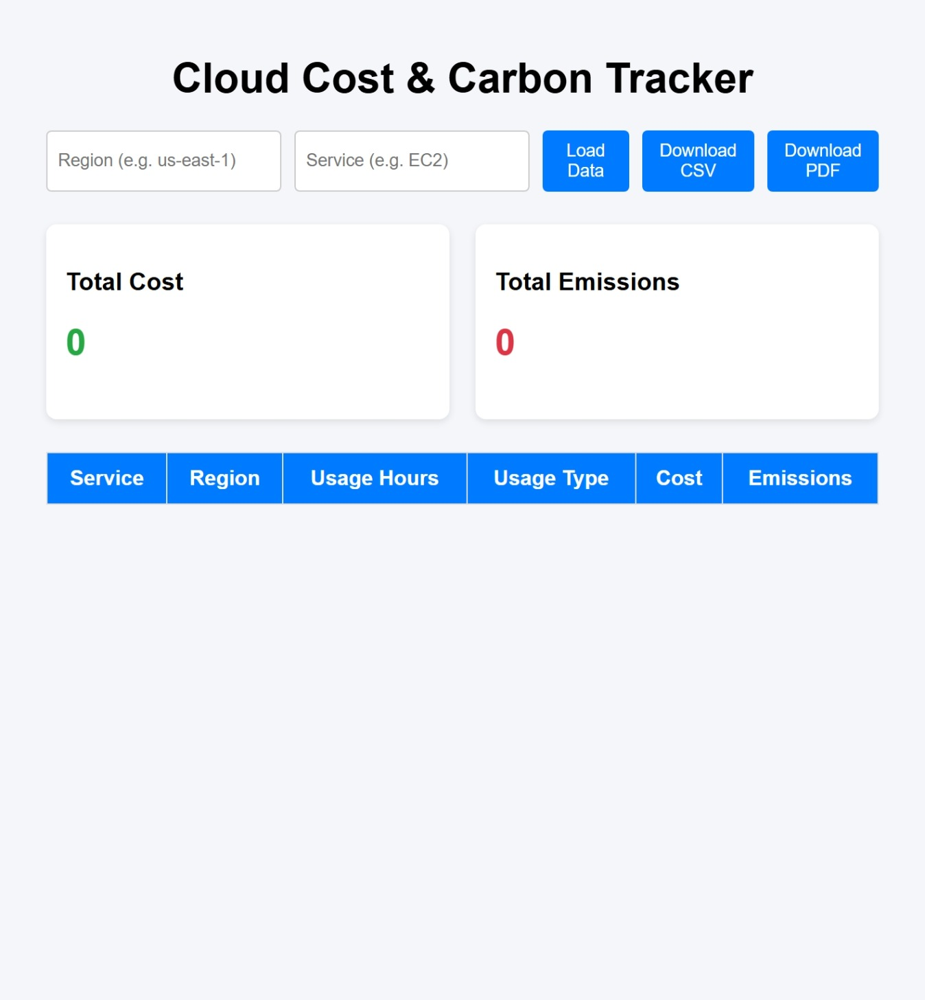
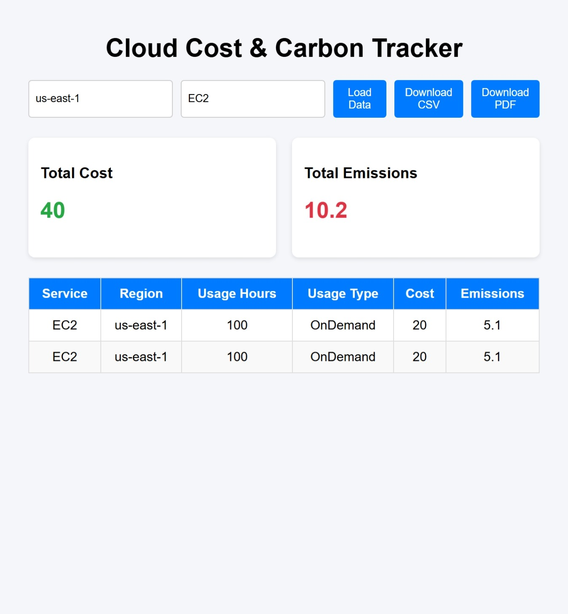
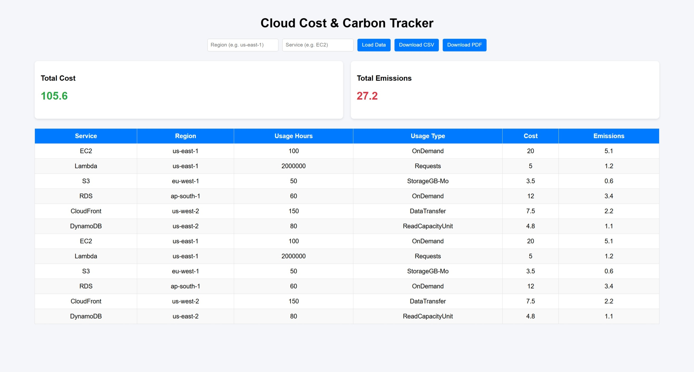
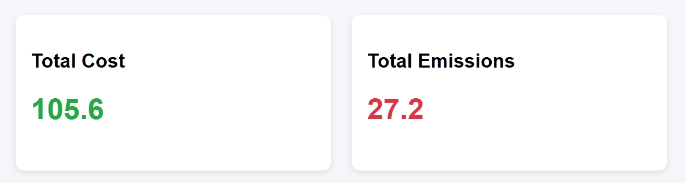

# Cloud Carbon & Cost Tracker

A full-stack analytics system to track cloud usage cost and carbon emissions.

## Overview

This project allows users to:

- Upload cloud usage data (CSV)
- Store data in PostgreSQL
- Analyze cost and carbon emissions
- Filter data by region and service
- Generate reports (CSV & PDF)
- Visualize insights via a web dashboard

---

## Features

- 📥 Upload cloud usage data
- 🗄️ Store in PostgreSQL database
- 🔍 Filter by region and service
- 📊 Summary analytics (cost & emissions)
- 📄 Export reports (CSV & PDF)
- 🌐 Interactive frontend dashboard

---

## Tech Stack

### Backend
- Python
- FastAPI
- SQLAlchemy
- PostgreSQL

### Frontend
- HTML
- CSS
- JavaScript (Fetch API)

### Other Tools
- Pandas (data processing)
- ReportLab (PDF generation)

---

## Architecture

The system follows a clean layered architecture:

Frontend (HTML + JS)
        ↓
FastAPI Backend (Routes → Services → Models)
        ↓
PostgreSQL Database


### Flow:

1. User uploads or queries data via frontend
2. FastAPI processes requests through service layer
3. Data is stored and retrieved from PostgreSQL
4. Analytics (filters & aggregations) are computed at DB level
5. Results are returned to frontend and rendered dynamically

---

## 📸 Screenshots

### Dashboard


### Filtered View



### Summary Section



---

## ⚙️ How to Run

### 1. Clone the repository
```bash
git clone https://github.com/your-username/Cloud-Carbon-and-Cost-Tracker.git
cd Cloud-Carbon-and-Cost-Tracker```
```
### 2. 
```
cd app
pip install -r requirements.txt
uvicorn main:app --reload
```
### 3 Setup Frontend
```
cd frontend
python -m http.server 5500
```
Open in Browser
```
http://localhost:5500
```

---

## Future Improvements

- Add authentication (user login system)
- Deploy using AWS (EC2 + RDS + S3)
- Add ML-based cost & emission forecasting
- Upgrade frontend using React
- Add interactive charts (Chart.js / Plotly)

